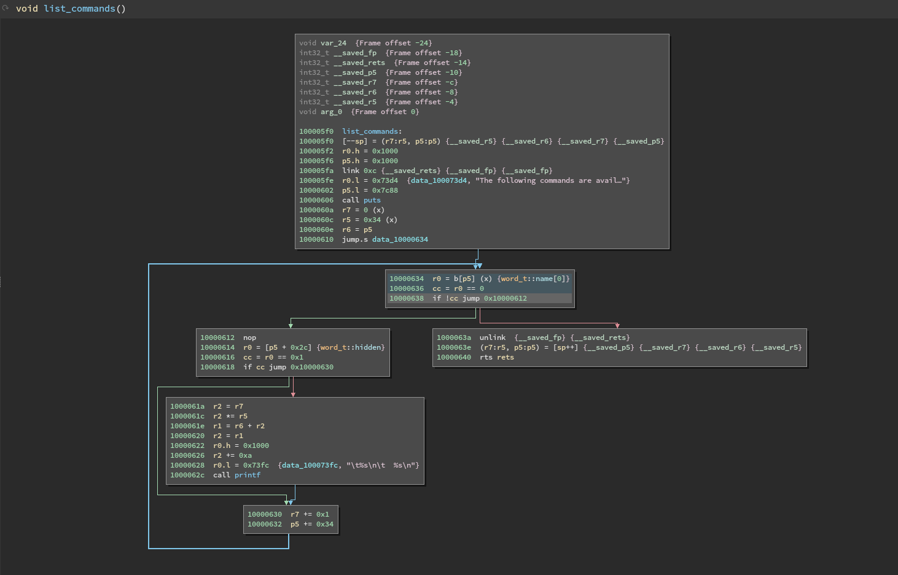
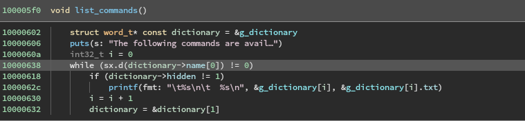

# Analog Devices Blackfin Architecture Plugin
A Binary Ninja architecture plugin for the AD Blackfin architecture. It includes a standalone disassembler, and fairly robust lifting capabilities.

## Disassembler
The disassembler used in this plugin (relagated to the disassembler/ subdirectory) can be used as a standalone decomposer/disassembler, and is not tied to the binaryninja API. It outputs tokenized structures representing each parsed machine code instruction, which can be parsed as desired by the disassembler frontend.
|  |
|:--:|
| *Yes, this is disassembly, not LLIL -- Blackfin uses arithmetic syntax for assembly* |
### Instruction Support
Disassembly of all instructions defined in the Blackfin Processor Programming Reference (Rev 2.2) is implemented. Additionally, a set of `pseudo_` instructions are implemented based on the libopcodes blackfin instruction parser, though these instructions do not appear in the above reference manual.

This disassembler supports only the Blackfin ISA, and _not_ the Blackfin+ superset used on BF7xx processor models. In addition to several new instructions, the Blackfin+ ISA also features a number of additional registers, and support for and usage of 64 bit instructions. At a minimum, support for detecting 64 bit instructions is planned, which would at least allow for disassembly of Blackfin compatible instructions in a Blackfin+ image.

## Lifter
|  |
|:--:|
| *HLIL output example* |

The lifter is mostly complete, with all standard operations supported, but lacking in support of some of the more complex/unusual DSP instructions and operating modes, including operations which saturate rather than overflow, and things like add with reverse bit carry that are complicated to implement correctly in BNIL. Additionally, some vector operations have yet to be implemented.

## Architecture Misc.
- Currently one standard calling convention (used by the bfin-* compilers, on uCLinux) and one system calling convention (same compilers) are defined.
- Extremely rudimentary ELF relocation handling is implemented via BlackfinElfRelocationHandler, and this handler is registered to the BinaryNinja Elf view with machine_id == 106.
- Equally rudimentary bFLT relocation handling is implemented via BlackfinBFLTRelocationHandler. Most of the heavy lifting for this handler is implemented in the bFLT view plugin.

## Building (Adapted from Vector35/arch-armv7)
Building the architecture plugin requires `cmake` 3.9 or above. You will also need the
[Binary Ninja API source](https://github.com/Vector35/binaryninja-api).

First, set the `BN_API_PATH` environment variable to the path containing the
Binary Ninja API source tree.

Run `cmake`. This can be done either from a separate build directory or from the source
directory. If your app is installed in a non-default location, set BN_INSTALL_DIR in your
cmake invocation, like `cmake -DBN_INSTALL_DIR=/Applications/Binary\ Ninja\ DEV.app/'.`
Once that is complete, run `make` in the build directory to compile the plugin.

The plugin can be found in the root of the build directory as `libarch_blackfin.so`,
`libarch_blackfin.dylib` or `arch_blackfin.dll` depending on your platform.

You can copy the plugin into the user plugins directory (you can locate this by using the 
"Open Plugin Folder" option in the Binary Ninja UI).

## Build Example

### acquire repositories
```
mkdir ~/repos/vector35
cd ~/repos/vector35
git clone git@github.com:Vector35/binaryninja-api.git
git clone git@github.com:git@github.com:Ethan-ks/arch-blackfin.git
```
### environment variables

`export BN_API_PATH=~/repos/vector35/binaryninja-api`

### cmake, make
```
cd arch-blackfin
mkdir build
cd build
cmake ..
make
```
## Build Troubleshooting

### example

    CMake Error at CMakeLists.txt:8 (message):
      Provide path to Binary Ninja API source in BN_API_PATH
    resolution:
    ensure BN_API_PATH is in your environment

### example

    CMake Error at /Users/andrewl/repos/vector35/binaryninja-api/CMakeLists.txt:53 (message):
      Binary Ninja Core Not Found
    resolution:
    ensure BN_INSTALL_DIR is supplied at command line invocation of cmake
    ensure some bad directory is not cached in CMakeCache.txt

### example

    cmake seems to ignore your setting of BN_INSTALL_DIR and other cmake variables
    resolution:
    rm CMakeCache.txt

### example

    undefined symbols at link time, like:
    Undefined symbols for architecture x86_64:
      "_BNClearUserVariableValue", referenced from:
      BinaryNinja::Function::ClearUserVariableValue(BinaryNinja::Variable const&, unsigned long long) in libbinaryninjaapi.a(function.cpp.o)
    resolution:
    ensure that your api repo is on the same channel and at the same commit as the libbinaryninjacore you're linking against
    eg: binaryninja is on dev update channel and is up-to-date and binaryninja-api repo is on branch dev with latest pulled

## Known Limitations
#### Incomplete Lifting
- Proper handling of flags: In most cases, conditionals are evaluated based on a manually set CC flag. However in some cases, the dedicated flags (AZ, AC, etc.) are used via the CCFlag instruction -- this instruction is not currently lifted, and flags are not set by operations presently.
- DSP multiplication operations, with/without fractionality, with/without saturation
- DSP vector shift operations
- PACK operation
- ABS operation
- DSP "to reg from accumulator" move operations (saturation, fractionality)
- Accumulator/accumulator arithmetic
- DIVQ and DIVS division primitives
- ROT instruction edge cases; common cases handled by lifter
- Vector addition/subtraction edge cases; common cases handled by lifter
- EXTRACT instruction
- SIGNBITS instruction
- ALIGN8, ALIGN16, ALIGN32 instruction
- DSP LSHIFT operation
#### Out-of-spec handling of 16 bit immediate loads
A common pattern observed in a number of sample binaries was the usage of a `reg.h = imm16; reg.l = imm16` idiom for loading a 32 bit immediate into a full width register. In most cases, the high load immediately precedes the low load, and as such the lifter combines the two operations into a single 32 bit load, which improves the resulting IL. However, in some cases the two operations are split up, and the resulting IL becomes messy, and breaks Binary Ninja's Value Set Analysis (VSA). 

In order to combat this, the lifter currently interprets a lone load high instruction as a 32 bit load to the full width register, assuming that the low bytes will be overwritten by a load low at some point before the register is read. This has been true in all cases observed during the development of this plugin, but _does not follow the Blackfin spec_ and technically produces incorrect IL. So far, the risk of occasional incorrect IL is outweighed by the greatly improved IL in the majority of cases, but be warned.
#### No support for parallel execution
Blackfin ISA supports the parallel execution of up to three instructions at once. This is not implemented in the disassembler or lifter at present, and input machine code is treated as entirely sequential. As a consequence, under very specific circumstances the resulting disassembly may be misinterpreted -- for example, when one instruction in the parallel issued set sets a register, and the next in the set uses that same register as a source. In reality, because the instructions are being executed in parallel, the value of the register used in the latter operation will not have been updated at execution time, but the disassembly output will indicate that this _is_ the case.
